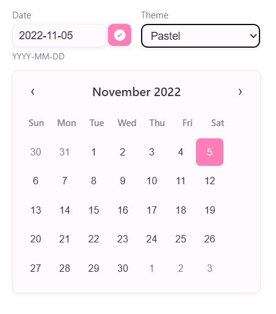

# Vue 3 Calendar Component



## Описание

Компонент-календарь на Vue 3 (Composition API) с поддержкой:

- Переключения месяцев и выбора даты
- Мультиязычности (английский, русский, немецкий, испанский)
- Тем оформления (нейтральный, пастельный, контрастный)
- Ввода даты вручную с синхронизацией календаря
- Хранения состояния даты и темы через Pinia
- Адаптивность учтена

Если дата не передана при инициализации, используется текущий день.

## Технологии

Vue 3 + Composition API

TypeScript

Vite

Pinia

SCSS

## Установка и запуск

```bash
npm install
npm run dev

```
